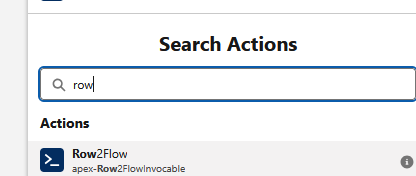

# Row2Flow

<a href="https://githubsfdeploy.herokuapp.com?owner=k-bentsen&repo=Row2Flow">
  
</a>

[Unlocked Package Install - Production](https://login.salesforce.com/packaging/installPackage.apexp?p0=04tam0000017GM1AAM)

[Unlocked Package Install - Sandbox](https://test.salesforce.com/packaging/installPackage.apexp?p0=04tam0000017GM1AAM)

## Overview
Row2Flow is a light-weight package that enables Salesforce admins to run "rows" of data from various sources like reports, list views, or SOQL across autolaunched/headless flows using the flexibility and scalability of Batch Apex. This takes heavy inspiration (and even some code) from Doug Ayers excellent tool, [Mass Action Scheduler](https://github.com/sfdx-mass-action-scheduler/sfdx-mass-action-scheduler), however differs in a few ways: flow is the only execution method, flow is invoked using Apex rather than through [API](https://github.com/sfdx-mass-action-scheduler/sfdx-mass-action-scheduler), and configuration is done by manually configuring custom metadata records. Furthermore, the idea to develop this feature arose from the [current limitation](https://ideas.salesforce.com/s/idea/a0B8W00000GdccSUAR/scheduled-flow-batch-size-option) to not be able to set a batch size for Scheduled Flow

## How to setup
Setting up a Row2Flow "action" consists of configuring 2 custom metadata types: (1) a parent "Row 2 Flow Configuration" record and (2) child "Row 2 Flow Mapping" record(s)

### Row 2 Flow Configuration
First, create your configuration with top level details such as Flow API Name, source type, source identifier, etc.
    

1. Enter a user friendly readable label for this Row2Flow action; you can auto-complete the API Name or change it yourself. **Note** this API Name will be important as it is used to identify this action for invocation
2. Set the Flow API Name of your target flow for this action 
3. Choose your source type; current options are **Report** **List View** and **SOQL**
4. Set your batch size - this will determine how many flow invocations will occur per batch chunk. IE if you have a report with 100 records and a batch size of 5, then the Batch Apex will execute in 20 chunks, each chunk running your flow 5 times.
5. Post Row2Flow action exectuion settings
    - Generate a "Row2Flow Results" sObject record with basic information about the run
    - Generate a text file that attaches to the results recovered to provide row level status of success or failure, and if failure, the associated error message
6. Fill out this section if **Report** option was chosen in (3)
    - A unique column header field on the report is required. This can be the record Id field or other unique field. **Note** it is recommended to verify the field API for the unique column header by using the [print report columns utility](README.md#print-report-columns).
    - The report Id\
           
         or API Name\
         

7. Fill out if **SOQL** option was chosen in (3) - the value of this field should start with the source sObject API and any filter conditions; SELECT fields can be omitted as they will automatically prepended to the query string based on the source values from the children mapping records.\
    

8. Fill out if **List View** option was chosen in (3)\
   

9. Active toggle if the Row2Flow action should be invocable or not.

### Row 2 Flow Mapping
Next, create your mappings of row source data values to target inputs of your flow.
    

1. Enter a label and name for each mapping.
2. Look-up to the Row 2 Flow Configuration created in the above step.
3. Choose a type. **Source Value** will be most commonly used and is what passes values from the row to the flow; you may use **Static** to set a static value to a flow input parameter.
4. If **Static** chosen in step (3), set a data type value. This will be necessary to evalute data formats such as date expected to be "YYYY-mm-dd", for example.
5. Choose the source row field API name. For SOQL and List View, this should almost always be the field API; for Report, many standard fields have non-intuitive API names, but you can use the [print report columns utility](README.md#print-report-columns) utility method to confirm 
6. Set your target flow variable; this **must** be set to "Available for input" in the varibale's options.\
    

## Execution
With your config and mapping records created, you can run it ad-hoc by executing the below code snippet in execute anonymous, ensuring to set the ```configAPIName``` variable to the same exact value from step (2) in the [configuration record setup](README.md#row-2-flow-configuration).
```
String configAPIName = '<your config record API name goes here>';
Row2FlowInvocable.Input inp = new Row2FlowInvocable.Input();
inp.configName = configAPIName;
Row2FlowInvocable.run(new List<Row2FlowInvocable.Input>{inp});
```
To run on a scheduled, create a scheduled flow (a) with the target object as "Row 2 Flow Configuration" custom metadata type and filter conditions **Custom Metadata Record Name** = same exact value from step (2) in the [configuration record setup](README.md#row-2-flow-configuration). Add a single action element(b) using "Row2FlowInvocable"(c) and passing the triggering record to the config input attribute(d).\
    a.   \
    b.   \
    c.   \
    d.   
    

> [!CAUTION]
> It is strongly recommended to not use this invocable action in any record-triggered flows as it can quickly fill up your running and queue Apex Batch jobs.

## Post Installation
If you have any system or integration users tied to daily Apex test runs or CI/CD jobs, it is recommended to assign them to the [Row2Flow Test Report Access Group](row2flow/main/default/groups/Row2Flow_Test_Report_Access.group-meta.xml) included in this package. Doing so ensures they have access to test reports required to run some classes where ```SeeAllData=true``` is required.

## Utilities

### Print Report Columns
1. Open developer console.\
   
2. On the menu bar, click debug; select Open Execute Anonymous Window.\
      
3. Type in the following using either the report Id or unique/API name depending on preference.\
     
4. Select "Open Log" option; click Execute button.\
    
5. After the execution runs and automatically opens the log, click "Debug Only" option.\
     
6. You should see something similar to below; the value on the left side of the arrow should be the column header that displays on the report in the UI, and the value on the right is the field API name that will need to be entered in step (5) for mappings.\
    

### Ad-Hoc Metadata-less Run

Use the [Row2FlowNoConfigInvocable.run](https://github.com/k-bentsen/Row2Flow/blob/master/row2flow/main/default/classes/Row2FlowNoConfigInvocable.cls#L29-L65) static method for an ad-hoc run without the need of the configuration and mapping metadata records. How-to coming soon... developers can probably figure it out :)
